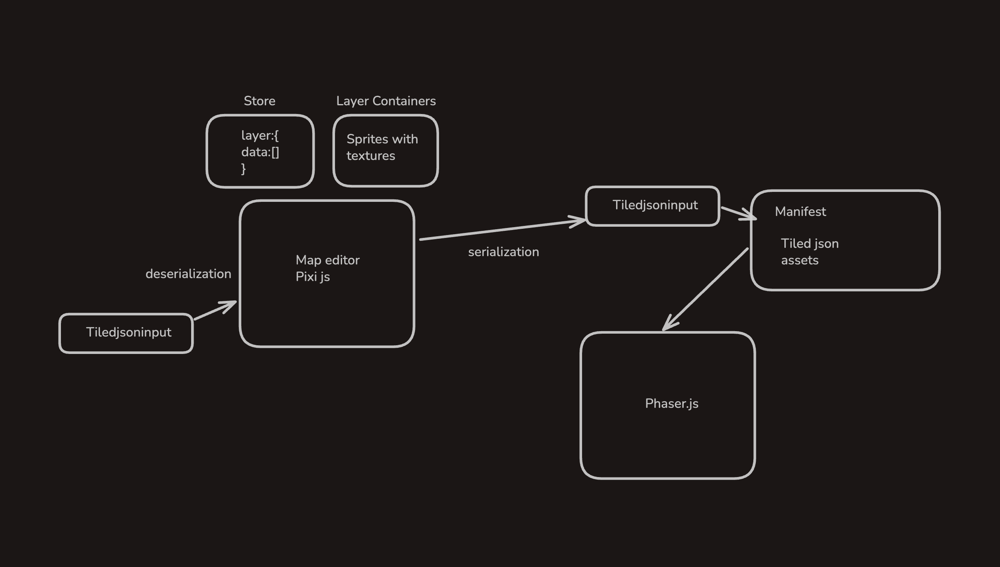

The editor is a main part of the project

Build with [pixi js](https://pixijs.com/) it can handle the 2d map easily
Map will handle Tiled json data type. The game engine/renderer used for the game part is Phaser.js
and it needs tiled json as the input for loading the game. Editor will handle the export and import of the json data.

Editor is builded after refering the [JSON Map format](https://doc.mapeditor.org/en/stable/reference/json-map-format/#json-layer) to make the output from the editor compactable with the phaser input

[Read about TileMap](https://textbooks.cs.ksu.edu/cis580/10-tile-maps/index.print.html)



Let me talk about some specific things here

We have now stored all the data requried for a layer in a 1D array. Which is a row major array.

how do we store a layer data in only numbers on a array -- read the blog above

Then we need a way to tell the array that we are talking about this image and then be able to say
take this part of the image and use in this index

for that imagine a image with 3 X 3 dimentions . we can say it have 9 tiles right .(0,0) will be called 1 (1,0) well be called 2 and so on
so we tell the array of a picture that fist image is from 1st postion and second image is form the. 4th postion and so on
that is how we construct a array with layer data on it

Now this was about 2d array.Storing data in a 1d array is much better for performance cause it store data in a contiguous block of memory. This led to use 1d as a standard option

**in 1d Array to find index, index=width\ x y+x for row major array**

### Storing image direction

Now Tiled do have a way to store if a image is flipped Horizontally,vertically and Diagonally.

If we were to do this intentionally with properties storing together with these number on array it would take more space and would turn into more complicated data to parse
Tiled do have a solution for this. They use **Bit Flipping** to make this happen

we store data as Uint32Array each element being a 32unsigned interger so we take the last. bits of these number
which would be unused (data would be under that 32 bit) so we flip those

```
bits 0-28 -> tile id (gid)
bit 29 -> horizontal flip (0 or 1)
bit 30 -> vertical flip (0 or 1)
bit 31 -> diagonal flip (0 or 1)
```

### Regarding Tilsets loading on Phaser js

As i have mentioned game part is phaser. How it serialize the data is important

[Docs related to how images or tilesets are loaded](https://docs.phaser.io/api-documentation/class/tilemaps-tilemap)

```json
 "tilesets": [
        {
            "columns": 16,
            "firstgid": 1,
            "image": "..\/tilesets\/trees.png",
            "imageheight": 1874,
            "imagewidth": 256,
            "margin": 0,
            "name": "trees",
            "spacing": 0,
            "tilecount": 1872,
            "tileheight": 16,
            "tilewidth": 16
        }
 ]
```

This is how a normal data exported from Tiled looks like

We dont need the image here. Image mentions the src of the image but phaser only read the **name** it require you to load image seperately with same name
