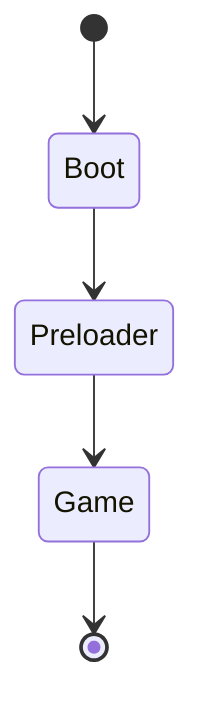

# Game Engine Documentation

> **Last Updated:** January 16, 2026

## Overview

The game system uses **Phaser 3** for real-time multiplayer virtual spaces. Players can explore 2D worlds, interact with other users, and participate in experiences.

---

## Architecture

```
features/game/
├── world/
│   ├── components/           # React UI overlays (4 files)
│   ├── engine/
│   │   ├── common/          # Shared utilities
│   │   ├── entities/        # Game entities (players, objects)
│   │   ├── hooks/           # React-Phaser bridges
│   │   ├── managers/        # Singleton managers
│   │   ├── scenes/          # Phaser scenes
│   │   │   ├── boot.ts      # Initial bootstrap scene
│   │   │   ├── preloader.ts # Asset loading scene
│   │   │   └── game.ts      # Main game scene
│   │   └── systems/         # ECS-style systems
│   └── types/
├── schema/
├── services/
└── index.ts
```

---

## Scene Flow



| Scene         | Purpose                     |
| ------------- | --------------------------- |
| **Boot**      | Initial config, settings    |
| **Preloader** | Asset loading, progress bar |
| **Game**      | Main gameplay loop          |

---

## GameManager

Singleton pattern for global game state:

```typescript
class GameManager {
   static instance: GameManager
   getInstance() // Returns singleton
}
```

### Known Issue

`getInstance()` is not static but accesses static `instance`. Should be `static getInstance()`.

---

## Technologies

| Library       | Version | Purpose                            |
| ------------- | ------- | ---------------------------------- |
| Phaser        | 3.90.0  | Game engine                        |
| PixiJS        | 8.12.0  | Rendering (shared with map editor) |
| pixi-viewport | 6.0.3   | Camera/viewport controls           |

---

## Features

- **Multiplayer Spaces** - Real-time user presence
- **Tile-based Maps** - Uses maps from Map Editor
- **Player Entities** - Avatar movement and animation
- **Scene Management** - Phaser scene lifecycle

---

## Improvements Needed

### Critical Issues

1. `GameManager.getInstance()` should be static
2. No cleanup/destroy methods visible
3. Missing error handling for asset loading

### Recommendations

1. Add WebSocket integration for multiplayer
2. Implement player interpolation/prediction
3. Add sound manager
4. Consider state machine for game states
